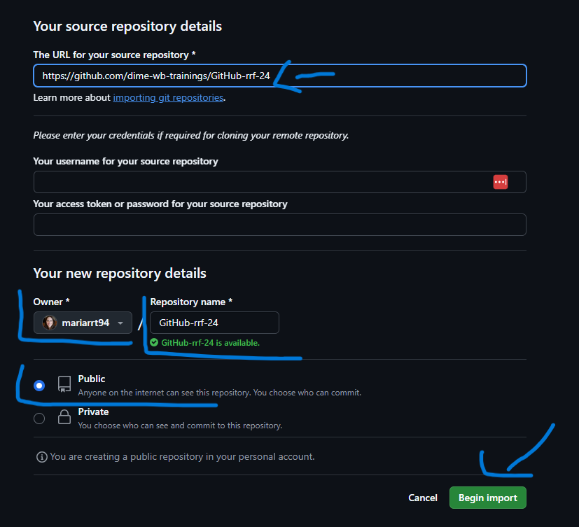
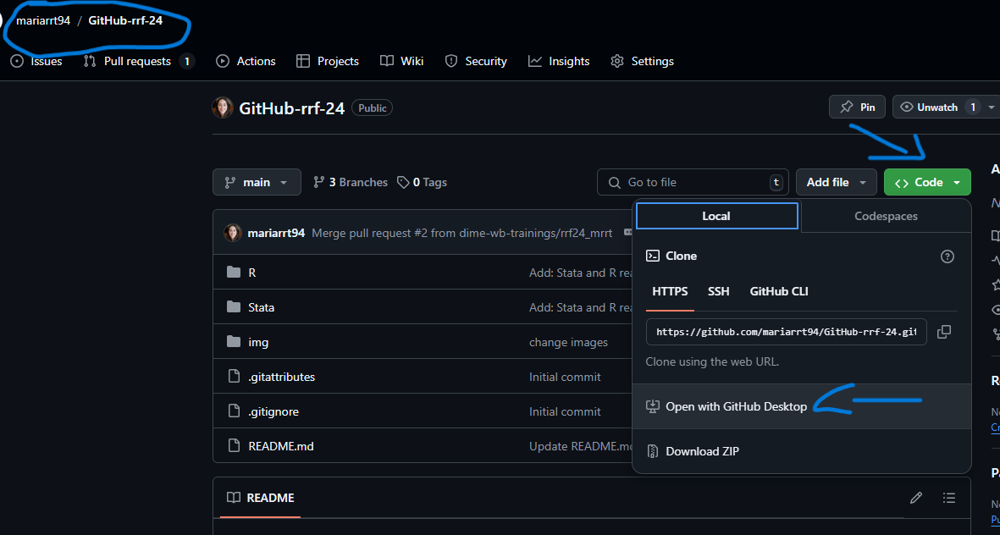
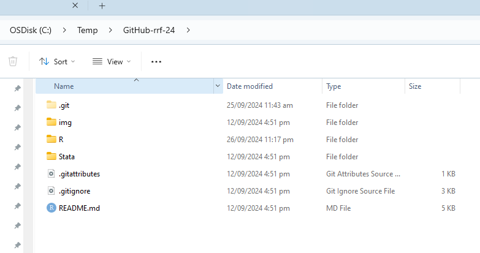

# Reproducible Research Fundamentals 2024
## Using GitHub for Collaborative Research - README

## Introduction

Welcome to the DIME Analytics training on GitHub and reproducible workflows. Over the next four days, you will learn how to implement transparent and reproducible workflows. This starts with essential GitHub skills and how to apply them in your data projects. The goal is for you to use GitHub across all stages of the data workflow—starting from data management to cleaning, tidying, constructing indicators, analysis, and exporting reproducible outputs.

This repository will serve as your workspace throughout the entire training. Follow the steps outlined below to set up your environment. Once set up, you will continue to work on this repository for the remainder of the sessions.

## Project Overview

You will use this repository locally for the rest of the training, so it is crucial to follow the instructions to import the repository to your machine. We will guide you step by step in the "Using GitHub for Collaborative Research" training, but the instructions are also provided below in case you miss any part.

## Using GitHub for Collaborative Research Training

In this training, you will learn to:

- Clone and **import** a GitHub repository.
- Create a branch for your work.
- Make commits and push changes.
- Follow a structured workflow for reproducibility.

### Setting Up Your GitHub Repository

❗❗**Important Exercise** You will use this repository throughout the training so please follow the steps (we will guide you during the session)

**Note** Normally, we clone a repository to collaborate with peers (which we covered in the training). However, for the rest of the week, we will use another download method—"import." In this case, the repository will start to live in your personal GitHub account, as if you created the repository yourself. It will no longer be linked to the DIME training repository. 

We use this method because, as many of you are new to GitHub, having all you working in one shared repository could become messy. This way, you will have your own repository where you can work independently!

### 1. Import the Repository

1. Go to the GitHub import page: [GitHub Importer](https://github.com/new/import).
2. In the `The URL for your source repository*` field, paste the following URL: `https://github.com/dime-wb-trainings/GitHub-rrf-24`.
3. Under `Owner`" select your personal GitHub account from the dropdown.
4. In the "Repository name" field, choose the name for your personal repository (`GitHub-rrf24-yourname`).
5. Click **Begin Import**.
6. Once the import is complete, your new repository will be available under your GitHub account.

### 2. Set Up Locally

1. Go to your new personal repository on GitHub.`https://github.com/your-username/GitHub-rrf-24-yourname`
2. Click the green "Code" button and select **Open with GitHub Desktop**
3. Follow the prompts to clone the repository locally and ensure it is set up for the rest of the training.

You will now have a local copy of the repository to work on for the rest of the week.

### 3. Creating a Branch in the project

As we mentioned in the training, we avoid commiting and pushing changes to the main branch. 
During this training and your projects we recommend you to follow the principle branch often merge often. Now follow this exercise to start branching in your project. 

2. Open github.com
3. Go to the branch button and click on the arrow.
4. Type `intro_github` and click `create branch intro_github from main`

4. Go to GitHub Desktop and click `fetch origin` 
5. Now you are working locally with your branch. 

- You can also switch between branches.

**Important**: You will continue working on your branch(es) for the rest of the training, and it will be reviewed by a peer at the end. In the next GitHub session, we will cover more advanced workflows, but **avoid committing to the main branch**. Only commit to your own branch(es).

---

## Key Reminders for the Week

- **You will be working on this repository throughout most of the hands-on sessions.**
- Each session will build on the previous one, and by the end, you will create a reproducibility package.
- Make sure to regularly *create branches*, *commit and push changes*, and *merge* them to keep your work organized and trackable.
- While you don’t need to branch excessively since this is your own project, we recommend the following workflow:
  - Create a new branch for each session, for example:
    - `rrf24_processing` → make changes and `commit` → merge back to `main`
    - `rrf24_construction` → make changes and `commit` → merge back to `main`
    - `rrf24_analysis`→ make changes and `commit` → merge back to `main`
    - `rrf24_create_package` → make changes and `commit` → merge back to `main``

---

## Overview of Upcoming Sessions

1. **GitHub Workflow**: Learn best practices for collaboration, branching, and merging on GitHub.
2. **Setting a Reproducible Environment**: Start your projects clean, share package versions, and ensure consistency across systems and time.
3. **Data Processing**: Master tidying and cleaning your data.
4. **Preparing Data for Analysis**: Organize and structure your data for thorough analysis.
5. **Data Analysis**: Perform your analysis using the cleaned datasets.
6. **Creating a Reproducibility Package**: Follow best practices to package your work, including writing a comprehensive README and proper documentation.

We’re excited to see your progress throughout the week!

---

### Useful Links:

- DIME Analytics GitHub Trainings: [DIME GitHub Trainings](https://osf.io/e54gy/)
- Markdown Cheat Sheet: [Markdown Guide](https://www.markdownguide.org/cheat-sheet/)
